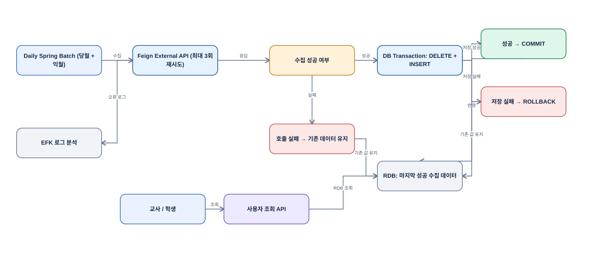

# Education Data Integration

**영역:** AI 디지털교과서(AIDT) 교육 플랫폼의 외부 데이터 연동  
**기간:** 2024.03–2025.06  
**주요 기술:** Java, Spring Boot, Spring Batch, Spring Cloud OpenFeign, MySQL, Redis

## 프로젝트 개요

교사와 학생이 사용하는 AI 디지털교과서 플랫폼의 구축부터 서비스 오픈 이후 운영까지 참여함. 콘텐츠·과제·운영자 기능을 개발하고, 운영 단계에서 사용자 문의·장애·외부 API 변경·데이터 조회 성능·보안 점검에 대응함.

연동 대상은 공공데이터포털의 **특일 정보 외부 API**([공공데이터포털 API 안내](https://www.data.go.kr/data/15012690/openapi.do))였음. 외부 시스템의 지연이나 장애가 사용자 조회에 직접 영향을 주지 않도록 **Spring Batch로 특일 정보를 미리 수집해 MySQL에 적재**하는 구조를 설계함.

## 담당 역할과 기술

- **직접 설계·구현:** 특일 정보 외부 API 정기 수집, Feign 호출 오류 대응, MySQL 트랜잭션 기반 데이터 교체
- **개발·운영:** React/TypeScript 화면 및 관리자 기능, 외부 연계 오류 분석, 운영 이슈 개선
- **기술 스택:** React, TypeScript, React Admin, Zustand, Recoil / Java, Spring Boot, Spring Batch, MyBatis, Feign Client / MySQL, Redis / Naver Cloud, EFK, GitLab CI/CD, Swagger, CSAP, Sparrow

## 문제와 설계 판단

특일 정보 외부 API를 매번 실시간 호출하면 외부 시스템의 응답 지연이나 일시적 실패에 영향을 받을 수 있었음. 이를 피하기 위해 정기 수집과 MySQL 적재를 분리하고, 수집 실패 시에도 마지막 정상 적재 데이터를 유지하도록 설계함.

### 구현 방식

[Draw.io 원본 편집](../diagrams/aidt-batch-reliability.drawio)

1. 매일 Spring Batch에서 공공데이터포털 **특일 정보 API의 당월·익월 데이터**를 수집함.
2. 외부 API 호출에는 Feign Timeout과 **최대 3회 재시도**를 적용함. 재시도 대상은 **Feign API 호출**이며 Batch Job 전체를 세 번 실행하는 방식은 아님.
3. 외부 API 수집이 성공한 경우에만 MySQL에서 대상 기간 데이터를 삭제하고 새 데이터를 INSERT함.
4. 삭제와 INSERT는 **하나의 DB 트랜잭션**으로 처리함. 저장 실패 시 ROLLBACK해 기존 데이터를 보존함.
5. 수집된 특일 정보는 MySQL에 보관함. 이후 특일 정보가 필요한 기능에서는 마지막 정상 적재 데이터를 활용하도록 구성함.
6. 외부 API 수집에 실패하면 기존 데이터를 유지하고 다음 정기 배치에서 갱신을 다시 시도함.

## 운영과 결과

외부 연계 시스템의 무응답 문제를 분석할 때 EFK(Elasticsearch, Fluentd/Fluent Bit, Kibana) 기반 로그 환경을 활용해 호출 및 오류 로그를 확인함.

- 특일 정보의 외부 API 호출과 서비스 데이터 활용 시점을 분리함.
- 수집·저장 실패 시 기존 MySQL 데이터를 보존하도록 구성함.
- 실시간 데이터 대신 마지막 정상 수집 데이터를 제공하므로 **최신성은 배치 주기에 종속됨.**
- 트랜잭션은 부분 갱신을 막지만, 외부 API가 반환한 데이터의 정확성까지 보장하지는 않음.
- 응답 시간 단축이나 장애율 개선의 정량 수치는 별도로 확인되지 않아 기재하지 않음.
