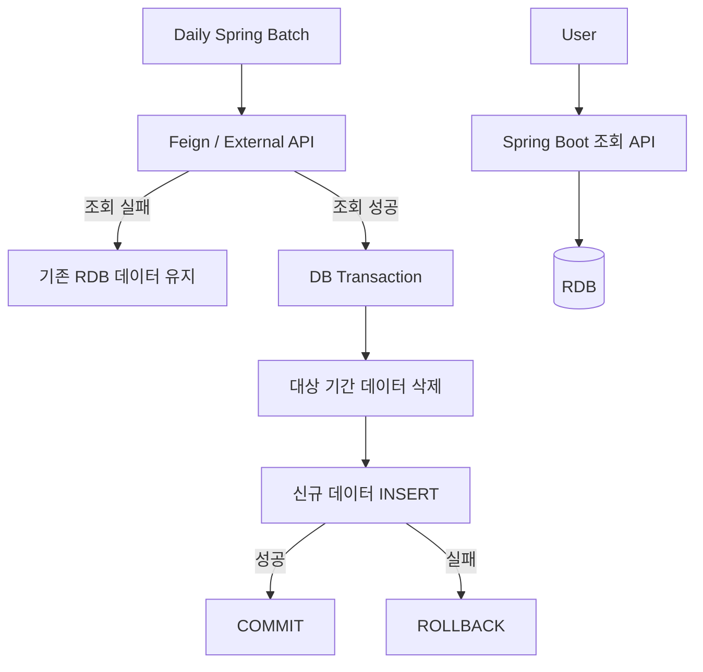

# Education Data Integration — Batch & Reliability

**영역:** 디지털 교육 서비스의 외부 데이터 연동  
**기간:** 2024.03–2025.06  
**주요 기술:** Java, Spring Boot, Spring Batch, Spring Cloud OpenFeign, RDB

## Project Background — 어떤 서비스였나

교사와 학생이 사용하는 **AI 디지털교과서(AIDT) 교육 플랫폼을 구축하고 서비스 오픈 이후 운영까지 담당한 프로젝트**입니다. 콘텐츠·과제·운영자 기능을 개발했으며, 운영 단계에서는 실제 사용자 문의와 장애, 외부 API 변경, 배치 안정성, 데이터 조회 성능, 보안 점검 대응이 이어졌습니다.

서비스는 React/TypeScript Frontend, Java/Spring Boot Backend, MySQL·Redis 및 Naver Cloud 기반으로 구성됐습니다. 일부 화면에서 필요한 정보는 외부 공공 API에 의존했기 때문에, 외부 시스템의 응답 지연이나 일시적 실패가 사용자 조회 경험에 영향을 주지 않도록 **정기 배치 사전 적재와 내부 RDB 우선 조회** 구조를 설계했습니다.

**담당 범위:** Full-stack 개발과 운영, 외부 API 데이터 수집·조회 구조 직접 설계 및 구현, 운영 이슈 분석과 개선. 구축부터 운영까지 이어진 경험이 핵심입니다.

## Tech Stack

- **Frontend / Admin:** React, TypeScript, React Admin, Zustand, Recoil
- **Backend:** Java, Spring Boot, Spring Batch, MyBatis, Feign Client
- **Database / Cache:** MySQL, Redis
- **Cloud / Operations:** Naver Cloud, EFK, GitLab CI/CD
- **API / Quality:** Swagger, CSAP, Sparrow

## Problem

외부 API의 간헐적인 장애와 응답 지연이 사용자 조회에 영향을 줄 수 있었습니다. 사용자 요청과 외부 시스템 호출을 분리하고, 데이터 갱신 실패 시에도 기존 데이터를 제공할 수 있는 구조가 필요했습니다.

## My Contributions

Spring Batch 수집·갱신 로직과 사용자 조회 API를 **직접 설계·구현**했습니다.

- 매일 정기 배치로 **당월·익월 데이터**를 외부 API에서 조회해 RDB에 사전 적재
- 외부 API 호출에 Feign Timeout·Retry 설정 적용
- 사용자 조회 API는 **정상·장애 상황 모두 RDB 우선 조회**
- **외부 API 조회 성공 후** 기존 대상 기간 데이터 삭제·재적재 시작
- 삭제와 신규 INSERT를 **동일 DB 트랜잭션**에서 처리; 실패 시 ROLLBACK
- 배치 실패 시 기존 데이터를 유지하고, **다음 날 정기 배치에서 갱신 재시도**

## Data Flow

## Engineering Decisions

1. **외부 API 호출과 사용자 조회 분리:** 사용자 요청이 외부 API 응답을 직접 기다리지 않도록 했습니다.
2. **조회 성공 후 교체:** 외부 API 장애로 인한 선삭제를 방지했습니다.
3. **원자적 데이터 교체:** 삭제·INSERT를 동일 트랜잭션으로 처리하여 교체 실패 시 기존 데이터를 보존했습니다.
4. **정기 재시도:** 별도의 즉시 재실행 대신 다음 정기 배치에서 갱신을 재시도했습니다.

## Design Trade-offs

- RDB 사전 적재는 외부 API 장애 영향을 줄이지만, 최신 데이터 반영은 배치 주기에 종속됩니다.
- 연속 실패 시 이전 데이터가 더 오래 유지될 수 있습니다.
- 트랜잭션 원자성은 DB 갱신 중 부분 반영을 방지하지만, 외부 API가 반환한 데이터의 완전성·정확성을 보장하지 않습니다.
