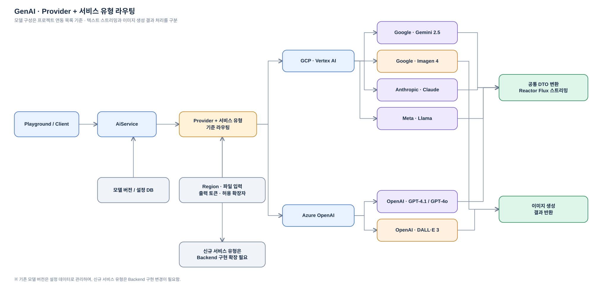

# Enterprise GenAI Platform

**영역:** 기업용 생성형 AI 플랫폼  
**기간:** 2025.07–2025.12  
**주요 기술:** Java, Spring Boot, React, TypeScript, Project Reactor, Gemini, GCP Vertex AI, Azure OpenAI

## 프로젝트 개요

기업 내부 사용자가 생성형 AI 과제를 신청하고 승인받은 뒤, 클라우드 환경에서 여러 LLM을 검증할 수 있도록 지원하는 플랫폼 구축 프로젝트임. 과제 신청·결재·인프라 준비·모델 검증으로 나뉜 업무를 하나의 서비스 흐름으로 연결했음.

React와 Spring Boot로 사용자 업무를 구현하고, 승인 후 인프라 자동화 인터페이스를 호출하도록 구성함. 애플리케이션은 AWS 환경에서 운영되며 GCP Vertex AI, Azure OpenAI 등 외부 AI 서비스를 연동하는 구조였음.

## 담당 역할과 기술

- **직접 설계·구현:** Multi-LLM 공통 아키텍처, Provider와 서비스 유형을 조합한 라우팅, 공통 요청·응답 DTO, Reactor Flux 스트리밍, Gemini 연동 및 시연, 모델 등록·버전 관리, 사용자별 이미지 생성 횟수 제한
- **협업:** 과제·결재 흐름과 인프라 프로비저닝 인터페이스 연계. 다른 Provider 연동과 실제 인프라 자동화 구현은 팀 단위로 진행함
- **기술 스택:** React, TypeScript, Vite, MUI, Zustand, React Query / Java, Spring Boot, MyBatis, Reactor, HikariCP / Gemini, GPT, Claude, Llama / Greenplum, Multi DataSource / AWS, GCP, Azure

## 문제와 설계 판단

### 1. 서로 다른 LLM 호출 방식 통합

Gemini, GPT, Claude, Llama 등은 SDK 지원 범위와 요청·응답 형식이 달랐음. 호출 로직을 화면이나 상위 업무 서비스에 직접 노출하면 Provider 추가 시 변경 범위가 커지는 문제가 있었음.

`AiService`에서 **Provider + 서비스 유형**을 기준으로 호출 경로를 결정하고, Provider별 서비스를 통해 결과를 공통 DTO로 변환하도록 설계함. 텍스트·멀티파트·이미지 생성 등 서비스 유형을 구분했으며, 스트리밍 응답은 Reactor `Flux`로 전달함. Java SDK가 지원되는 기능은 SDK를 우선 사용하고, REST API만 제공되는 기능은 직접 HTTP 연동함.

### 2. 모델 버전과 신규 서비스 유형 구분

기존 모델의 버전 변경은 DB에 저장된 모델 정보를 수정해 대응하도록 구성함. 반면 신규 서비스 유형은 Backend의 모델 정의, Provider 서비스 및 라우팅 구현을 확장해야 했음. **버전 업데이트가 가능한 구조이지, 모든 모델을 코드 수정 없이 추가하는 플러그인 구조는 아님.**

### 3. 승인 업무와 인프라 실행 책임 분리

과제 상태와 결재 상태를 구분하고, 승인 이후 CREATE / UPDATE / DELETE 유형에 따라 인프라 프로비저닝 인터페이스를 호출함. 실제 클라우드 자원 생성·변경·삭제는 인프라 자동화 영역에서 수행함. 프로비저닝 실패 시에는 인프라 담당자가 결과를 확인하고 후속 조치했음.

### 4. 사용량 통제

사용자별 하루 이미지 생성 10회 제한과 DB 기반 생성 이력·횟수 관리를 구현함. 모델 정보는 DB에서 관리했으나 사용량 제한 정책의 변경은 소스 수정이 필요한 구조였음.

## 구현 구조 — 실제 연동 모델과 요청 조건

[Draw.io 원본 편집](../diagrams/genai-routing.drawio)

그림은 **Provider와 서비스 유형을 조합해 호출 경로를 선택**하는 구조를 나타냄. GCP Vertex AI에서는 Google·Anthropic·Meta 모델을, Azure에서는 OpenAI 모델을 연동했음. 모델별 세부 API 호출 구현은 팀에서 나눠 진행했으며, **공통 라우팅 구조와 Gemini 연동을 직접 설계·구현하고 검증**했음.

### 모델 연동 범위

| Cloud | Provider / 모델 계열 | 프로젝트 모델 목록 예시 | 구분 |
| --- | --- | --- | --- |
| GCP | Google · Gemini | Gemini 2.5 Pro, Flash, Flash-Lite | 멀티모달 LLM |
| GCP | Google · Imagen | Imagen 4 Generate, Fast | 이미지 생성 |
| GCP | Anthropic · Claude | Opus 4, Sonnet 4, Haiku 3.5, Haiku 3 | LLM |
| GCP | Meta · Llama | Llama 4 Maverick, Scout, Llama 3.1 405B | LLM |
| Azure | OpenAI · GPT | GPT-4.1, 4.1 Mini, 4.1 Nano, GPT-4o | LLM |
| Azure | OpenAI · DALL·E | DALL·E 3 | 이미지 생성 |

위 목록은 **프로젝트 모델 관리 자료에 등록된 연동 대상**을 요약한 것임. Gemini 2.0 Flash 계열은 제공 자료에서 취소선으로 표시되어 목록에서 제외함. 모델 이름과 버전은 당시 프로젝트 자료 기준이며 현재 서비스 제공 여부나 최신 모델 목록을 의미하지 않음.

### 모델별 설정 차이를 공통 구조로 처리한 이유

- **Region:** 모델별 사용 Region이 서로 달랐음. 제공된 관리 자료에는 `us-central1`, `us-east5` 등이 포함됨.
- **파일 전달 방식:** Gemini·GPT·Llama 등은 자료상 `Image URI`, Claude는 `Base64`로 구분되어 있었음. 따라서 멀티모달 입력을 동일한 요청 객체만으로 모든 Provider에 전달할 수는 없었음.
- **허용 입력 형식:** 이미지 외에 동영상·문서·오디오를 받는 모델이 있었고, 허용 확장자도 모델별로 달랐음. 모델 선택 시 지원 형식에 맞는 요청을 구성해야 했음.
- **최대 출력 토큰:** 자료에 Gemini 2.5 계열 `65,535`, Claude·Llama 계열 `4,096`, GPT-4.1 계열 `32,768` 등 서로 다른 값이 기재되어 있었음. 이 값은 **당시 프로젝트 관리 설정**이며 모델 자체의 현재 공식 한도와 동일하다고 단정하지 않음.
- **응답 형태:** LLM의 텍스트 스트리밍은 공통 DTO와 Reactor `Flux`로 처리하고, 이미지 생성은 별도의 생성 결과 흐름으로 구분함.

기존 모델의 버전 정보 갱신은 DB 설정 변경으로 처리할 수 있었으나, **새로운 서비스 유형 추가는 Provider 서비스 및 Backend 라우팅 구현 확장이 필요했음.**

## 결과와 한계

- 여러 Provider를 공통 호출 계약으로 연결하고 Gemini 연동으로 설계를 검증·시연함.
- 기존 모델 버전 변경은 DB 정보 수정으로 대응할 수 있도록 구성함.
- Provider별 SDK·REST API 차이를 서비스 계층에서 관리하는 대신, 신규 서비스 유형 추가 시 Backend 확장이 필요함.
- 업무 승인과 실제 인프라 실행을 분리했으나, 프로비저닝 실패의 자동 복구까지 구현한 것은 아님.
- 이미지 생성 횟수를 사용자 단위로 제한했으나, 정책 변경에는 코드 수정이 필요함.

정량적인 운영 시간 단축이나 비용 절감 수치는 별도로 확인되지 않아 기재하지 않음.
