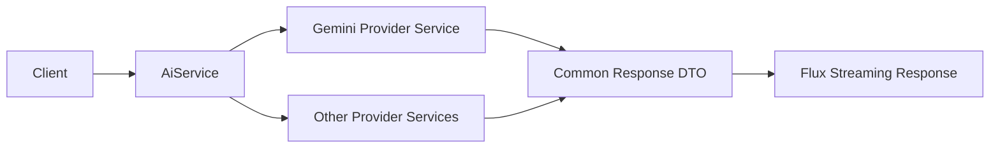
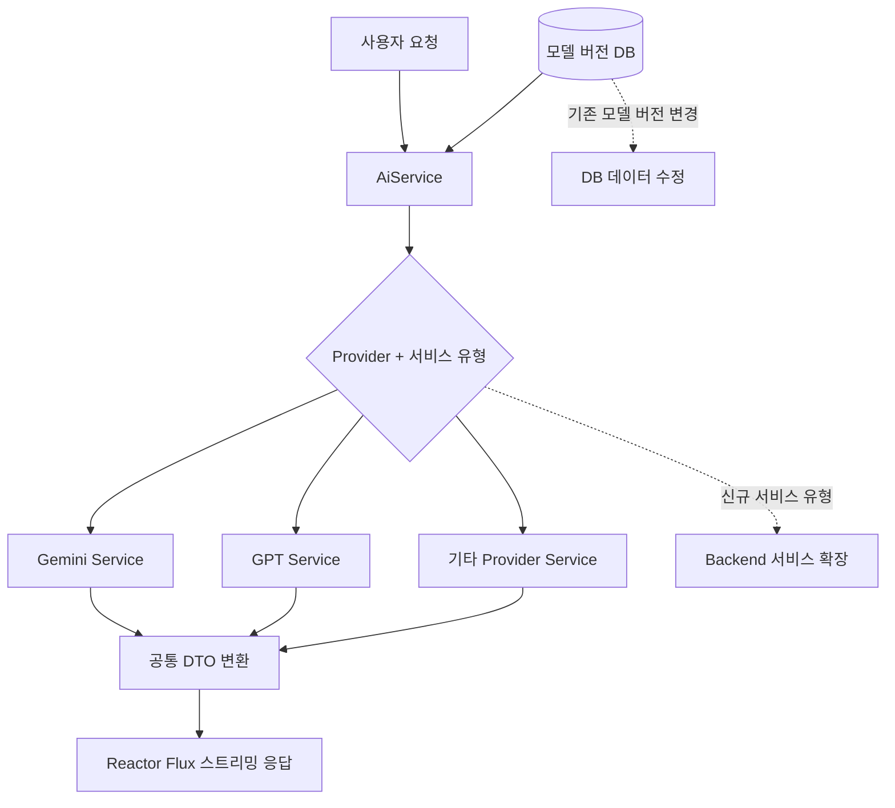

# Enterprise GenAI Platform

**영역:** 기업용 생성형 AI 플랫폼  
**기간:** 2025.07–2025.12  
**주요 기술:** Java, Spring Boot, Project Reactor (Flux), Gemini, GCP Vertex AI, Azure OpenAI

## Project Background — 어떤 서비스였나

기업 내부 사용자가 **생성형 AI 과제를 신청하고, 승인받은 뒤 필요한 클라우드 환경과 LLM을 검증하는 사내 플랫폼** 구축 프로젝트임. 기존에는 과제 등록·결재·인프라 준비·모델 검증 과정이 각각 분리되어 있어, 사용자가 AI 실험 환경을 사용하기까지 여러 업무 단계와 시스템을 거쳐야 했음.

플랫폼은 **React 기반 사용자 화면과 Spring Boot 애플리케이션**으로 업무 흐름을 연결하고, 승인 이후 기존 인프라 자동화 인터페이스를 통해 클라우드 자원 준비를 요청했음. 애플리케이션은 AWS 환경에서 운영되며 GCP Vertex AI 및 Azure OpenAI 등의 AI 서비스를 호출하는 Cross-Cloud 구성이었습니다. 사용자는 공통 Playground에서 여러 Provider의 모델을 사용할 수 있도록 설계했음.

**프로젝트에서 해결해야 했던 과제**는 모델 API 연결 자체보다, 기업의 승인·보안·자원·비용 정책을 지키면서 여러 AI Provider를 하나의 서비스 경험으로 제공하는 것이었습니다.

**담당 범위:** React/Spring Boot Full-stack 개발, Multi-LLM 공통 아키텍처 설계와 핵심 호출 흐름 구현, 업무 Workflow 및 인프라 연계 협업. 모델별 연동과 인프라 자동화 전체는 팀 단위 구현 범위를 포함함.

## Tech Stack

| 영역 | 기술 |
| --- | --- |
| Frontend | React, TypeScript, Vite, MUI, Zustand, React Query |
| Backend | Java, Spring Boot, MyBatis, Project Reactor (Flux), HikariCP |
| AI / Models | Gemini, Claude, Llama, GPT, Google Gen AI SDK, Anthropic Java SDK, Azure OpenAI SDK, Vertex AI, GoogleCredentials |
| Batch / Scheduling | Spring Batch, Quartz |
| Data | Greenplum, Multi DataSource |
| Cloud | AWS, GCP, Azure |

## Technical Leadership & Architecture Decisions

이 프로젝트에서는 AI 모델 연동뿐 아니라 **업무 Workflow, 인프라 자동화, 모델 Provider 사이의 책임 경계**를 고려했음. 아래는 직접 설계·구현한 부분과 팀 단위로 협업한 결정을 구분한 기록임.

### Decision 1 — 과제·결재 Lifecycle과 Infrastructure Provisioning 분리

- **Context:** 과제 신청·결재·클라우드 환경 준비가 서로 다른 단계로 진행되며, 승인 여부와 실제 리소스 준비 상태가 동일하지 않았습니다.
- **Alternatives:** 과제·결재·리소스 상태를 단일 Workflow로 결합하는 대신, 업무 상태를 분리하고 기존 인프라 자동화 인터페이스를 호출하는 구조를 검토했음.
- **Decision:** 과제 상태와 결재 상태를 별도로 관리하고, 승인 후 CREATE / UPDATE / DELETE 유형에 따라 Provisioning I/F를 호출했음. 실제 리소스 생성·변경·삭제는 Infra Automation에 위임했음.
- **Trade-off:** Application과 Infrastructure의 변경 책임을 분리했지만, 인프라 처리 결과를 별도로 조회하고 실패 시 업무 담당자가 확인·수동 재처리해야 했음.
- **Ownership & Impact:** 업무 Workflow와 인프라 연계 구조의 설계·개발에 참여해, 신청부터 환경 사용까지 연결되는 플랫폼 흐름을 구현했음. 인프라 자동화 엔진 자체를 개인이 구현했다는 의미는 아닙니다.

### Decision 2 — Multi-Provider 모델 통합의 공통 계약 설계

- **Context:** Gemini, Claude, Llama, GPT 등 모델마다 SDK, 요청 형식, 스트리밍 응답 구조가 달랐습니다.
- **Alternatives:** 각 모델의 호출 로직을 상위 서비스에 직접 노출하는 방식보다 Provider Service를 분리하고 공통 결과 모델로 변환하는 방식을 선택했음.
- **Decision:** `AiService`에서 모델별 Provider로 라우팅하고, Provider별 응답을 공통 DTO로 변환한 뒤 Reactor `Flux`로 스트리밍했음. SDK 지원 범위를 벗어나는 기능에는 REST API를 활용했음.
- **Trade-off:** 공통 호출 흐름을 유지할 수 있지만 신규 모델 유형은 서비스 구현과 라우팅 분기 수정이 필요함. Provider 고유 기능을 공통 모델에 반영하는 작업도 남습니다.
- **Ownership & Impact:** 통합 아키텍처 설계, `AiService` 라우팅·공통 DTO·스트리밍 구현, Gemini 직접 연동을 통한 설계 검증을 담당했음. 나머지 Provider 연동 전체는 팀 단위 성과임.

### Decision 3 — 기업용 AI 자원·비용·접근 정책 반영

- **Context:** 사내 사용자가 제한 없이 Cloud Resource와 모델을 사용하면 운영 정책과 비용 통제가 어려워질 수 있었음.
- **Alternatives:** 사용자 자율 생성 대신 승인 절차와 허용 리소스 범위를 통해 사용 가능 환경을 제한했음.
- **Decision:** 승인 결과를 Provisioning I/F와 연결하고, 허용된 Instance Type·Region·Resource·비용 범위에 맞춰 선택하도록 구성했음. SSO와 리소스 단위 접근 검증을 연계하고, 이미지 생성은 사용자별 하루 10회 제한을 적용했음.
- **Trade-off:** 비용·접근 정책을 통제하는 대신 선택 가능한 자원과 운영 유연성이 제한됨. 프로비저닝 실패는 자동 반복 실행보다 담당자 확인·수동 재처리를 택했음.
- **Ownership & Impact:** 이미지 생성 이력·사용량 제한은 직접 구현했음. 접근 정책 및 Provisioning Workflow는 프로젝트 내 설계·구현 협업 범위이며, 클라우드 리소스 자동 생성 전체를 단독 개발한 것으로 표현하지 않음.

## Problem

여러 AI Provider의 모델 호출 방식과 스트리밍 이벤트가 달라, 통합된 API와 모델 확장 구조가 필요했음. 또한 기업 환경의 접근 정책, 리소스 프로비저닝 및 이미지 생성 사용량 통제가 요구됐습니다.

## My Contributions — Architecture & Direct Implementation

- Multi-LLM 통합 아키텍처 설계
- **Gemini 직접 연동**으로 전체 아키텍처의 호출 흐름을 검증하고 시연
- `AiService`의 모델·Provider 라우팅 분기 구현
- Provider Service 및 모델 호출 API 구현
- Provider별 요청·응답을 공통 DTO로 변환하는 처리 구현
- Reactor `Flux` 기반 스트리밍 응답 처리 구현
- 모델 등록 및 버전 관리 기능 구현
- **사용자별 하루 이미지 생성 10회 제한**과 DB 기반 생성 이력·횟수 관리 구현

Gemini는 설계 검증·시연을 위해 직접 연동한 사례임. 다른 모든 Provider를 개인이 구현했다고 주장하지 않음.

## Architecture & Decisions

- Provider별 서비스 구현을 분리하고 `AiService`가 호출 경로를 결정하도록 구성했음.
- Provider별 스트리밍 이벤트를 공통 DTO로 변환했음.
- **기존 모델의 신규 버전:** 버전 데이터 추가로 대응했음.
- **신규 모델 유형:** 모델 정의·설정, 서비스 구현, `AiService` 분기 추가가 필요했음. 완전한 무코드 플러그인 구조는 아닙니다.
- 공식 SDK를 우선 사용하고, SDK가 지원하지 않는 기능에는 REST API 호출을 적용했음.
- Provider 오류는 대체로 원본을 전달했음. 공통 오류 정규화나 자동 Provider Fallback을 구현했다고 주장하지 않음.

## Team Deliverables — Shared Scope

- Gemini, GPT, Claude, Llama 등을 포함한 다수 모델 통합
- GCP Vertex AI와 Azure OpenAI를 통한 모델 배포 및 관련 인프라 리소스 자동 생성
- 생성 요청은 비동기로 처리하고, 진행 상태는 클라우드 API에 직접 조회
- 고객사 기존 보안·인증 환경과의 연계

멀티클라우드 프로비저닝은 아키텍처 설계 참여 및 **팀 단위 구현 성과**로 구분함. 개별 프로비저닝 API를 직접 구현했다고 기재하지 않음.

## Reliability, Governance & Trade-offs

- Timeout·Retry·Rate Limit 대응은 공유 HTTP 클라이언트/인터셉터 영역에서 처리했음. 이미지 생성 일일 제한과 Provider API 제한은 별개의 정책임.
- 사용자별 하루 10회 이미지 생성 제한은 DB 이력·횟수를 이용한 비즈니스 정책임.
- Provider별 구현 분리로 공통 호출 구조를 유지할 수 있지만, 신규 모델 유형에는 코드 확장이 필요함.
- 비동기 클라우드 리소스 생성은 긴 대기 시간을 요청 처리에서 분리하지만, 별도의 상태 조회가 필요함.

## Implementation — Multi-LLM 라우팅과 모델 운영

- **라우팅 기준:** Provider와 서비스 유형을 조합해 텍스트·멀티파트·이미지 생성 등 호출 경로를 구분했음.
- **연동 방식:** Java SDK가 제공되는 기능은 Provider SDK를 사용하고, REST API만 제공되는 기능은 직접 REST API로 연동했음.
- **모델 관리:** 기존 모델의 버전 변경은 DB 정보 변경으로 대응했음. 새로운 서비스 모델·유형은 Backend 모델 및 서비스 구현을 확장했음.
- **운영 정책:** 모델 정보 관리와 사용자별 이미지 생성 횟수 제한을 제공했음. 사용량 제한 정책은 소스 수정으로 조정 가능한 구조였음.
- **실패 처리:** 승인 후 프로비저닝 실패 시 인프라 담당자가 확인하고 후속 조치했음.

## Impact & Trade-offs — 모델 확장과 운영 통제

| 개선 효과 | 선택한 방식의 한계 |
| --- | --- |
| 기존 모델 버전 변경 시 DB 데이터 수정으로 대응 | 신규 서비스 유형은 Backend 코드 확장이 필요 |
| 여러 Provider를 공통 애플리케이션 흐름에서 제공 | SDK와 REST API 연동 방식별 유지보수 필요 |
| 운영자가 모델 정보를 쉽게 관리하고 사용량 제한 정책 조정 가능 | 사용량 정책 변경은 코드 수정이 필요할 수 있음 |
| 인프라 자동화와 업무 승인 책임 분리 | 프로비저닝 실패 시 담당자 수동 조치 필요 |

## Editable Draw.io Architecture Diagrams

- **Multi-LLM 라우팅 및 모델 관리:** [Draw.io 원본](../diagrams/genai-routing.drawio) · [diagrams.net에서 열기](https://app.diagrams.net/?url=https%3A%2F%2Fraw.githubusercontent.com%2Fkimjihyeon99%2Fengineering-portfolio%2Fmain%2Fdiagrams%2Fgenai-routing.drawio)
