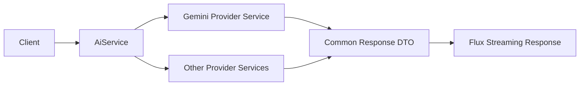

# Enterprise GenAI Platform

**영역:** 기업용 생성형 AI 플랫폼  
**기간:** 2025.07–2025.12  
**주요 기술:** Java, Spring Boot, Project Reactor (Flux), Gemini, GCP Vertex AI, Azure OpenAI

## Problem

여러 AI Provider의 모델 호출 방식과 스트리밍 이벤트가 달라, 통합된 API와 모델 확장 구조가 필요했습니다. 또한 기업 환경의 접근 정책, 리소스 프로비저닝 및 이미지 생성 사용량 통제가 요구됐습니다.

## My Contributions — Architecture & Direct Implementation

- Multi-LLM 통합 아키텍처 설계
- **Gemini 직접 연동**으로 전체 아키텍처의 호출 흐름을 검증하고 시연
- `AiService`의 모델·Provider 라우팅 분기 구현
- Provider Service 및 모델 호출 API 구현
- Provider별 요청·응답을 공통 DTO로 변환하는 처리 구현
- Reactor `Flux` 기반 스트리밍 응답 처리 구현
- 모델 등록 및 버전 관리 기능 구현
- **사용자별 하루 이미지 생성 10회 제한**과 DB 기반 생성 이력·횟수 관리 구현

Gemini는 설계 검증·시연을 위해 직접 연동한 사례입니다. 다른 모든 Provider를 개인이 구현했다고 주장하지 않습니다.

## Architecture & Decisions

- Provider별 서비스 구현을 분리하고 `AiService`가 호출 경로를 결정하도록 구성했습니다.
- Provider별 스트리밍 이벤트를 공통 DTO로 변환했습니다.
- **기존 모델의 신규 버전:** 버전 데이터 추가로 대응했습니다.
- **신규 모델 유형:** 모델 정의·설정, 서비스 구현, `AiService` 분기 추가가 필요했습니다. 완전한 무코드 플러그인 구조는 아닙니다.
- 공식 SDK를 우선 사용하고, SDK가 지원하지 않는 기능에는 REST API 호출을 적용했습니다.
- Provider 오류는 대체로 원본을 전달했습니다. 공통 오류 정규화나 자동 Provider Fallback을 구현했다고 주장하지 않습니다.

## Team Deliverables — Shared Scope

- Gemini, GPT, Claude, Llama 등을 포함한 다수 모델 통합
- GCP Vertex AI와 Azure OpenAI를 통한 모델 배포 및 관련 인프라 리소스 자동 생성
- 생성 요청은 비동기로 처리하고, 진행 상태는 클라우드 API에 직접 조회
- 고객사 기존 보안·인증 환경과의 연계

멀티클라우드 프로비저닝은 아키텍처 설계 참여 및 **팀 단위 구현 성과**로 구분합니다. 개별 프로비저닝 API를 직접 구현했다고 기재하지 않습니다.

## Reliability, Governance & Trade-offs

- Timeout·Retry·Rate Limit 대응은 공유 HTTP 클라이언트/인터셉터 영역에서 처리했습니다. 이미지 생성 일일 제한과 Provider API 제한은 별개의 정책입니다.
- 사용자별 하루 10회 이미지 생성 제한은 DB 이력·횟수를 이용한 비즈니스 정책입니다.
- Provider별 구현 분리로 공통 호출 구조를 유지할 수 있지만, 신규 모델 유형에는 코드 확장이 필요합니다.
- 비동기 클라우드 리소스 생성은 긴 대기 시간을 요청 처리에서 분리하지만, 별도의 상태 조회가 필요합니다.
