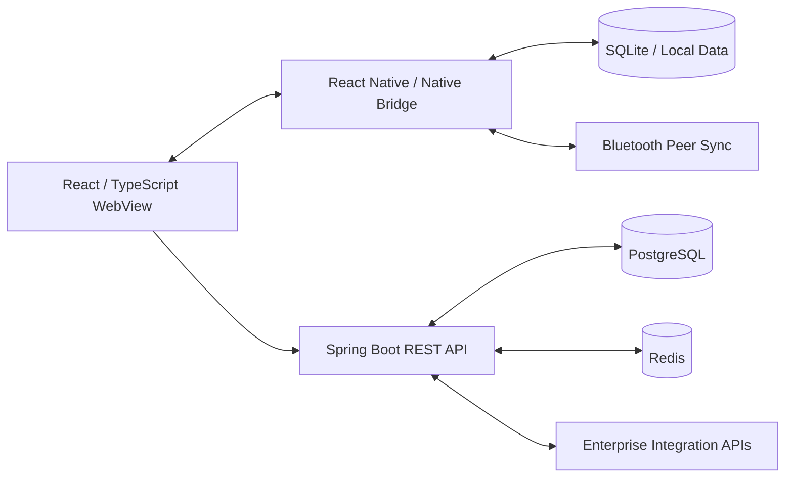
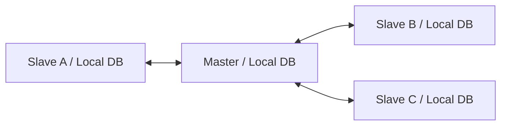

# Offline-first Operations System

**영역:** 연결이 제한된 현장 업무용 통합 시스템  
**기간:** 2026.01–2026.09  
**주요 기술:** Java, Spring Boot, React, TypeScript, React Native, TanStack Query, PostgreSQL, Redis, SQLite, Bluetooth

## Project Background — 어떤 서비스였나

항공기 객실 승무원이 **비행·승객·기내 서비스 정보를 확인하고 업무를 처리하는 통합 시스템** 구축 프로젝트입니다. 현장용 Mobile/Hybrid App뿐 아니라 운영자용 Admin, 협력사용 Partner 시스템이 함께 연결되는 기업 업무 환경이었습니다.

객실 업무는 **네트워크 연결이 불안정하거나 끊길 수 있는 기내 환경**에서도 이어져야 했습니다. 따라서 단말의 SQLite 등 로컬 데이터와 Bluetooth 기반 단말 간 동기화가 필요했고, 네트워크가 연결된 상황에는 Spring Boot Backend와 PostgreSQL·Redis, 기업 내부·외부 연계 시스템을 활용했습니다. React WebView와 React Native/Native Bridge가 결합된 구조여서 화면·Native·서버 사이의 데이터 흐름을 함께 고려해야 했습니다.

또한 기내식·객실 업무 등 여러 업무 기능이 외부 시스템과 연계되어, **인터페이스 명세 협의부터 통합 테스트와 오류 대응까지** 개발 조직 간 조율이 중요했습니다.

**담당 범위:** Full-stack 개발, Application Architecture 검토, Offline/Bluetooth 동기화 안정화, 외부 시스템 인터페이스 설계·조율 및 **UM Letter 기능 전체 설계**. UM Letter의 상세 업무 흐름과 내부 데이터 구조는 별도 설명 없이 추정하지 않았습니다.

## Tech Stack

| 영역 | 기술 |
| --- | --- |
| Mobile / Frontend | React, TypeScript, React Native, WebView, TanStack Query |
| Backend | Java, Spring Boot, REST API |
| Database / Cache | PostgreSQL, Redis, SQLite, WebCache |
| Offline / Native | Native Bridge, Bluetooth Sync |
| Enterprise Integration | API Gateway, EAI, ERP, External API |
| Cloud / Delivery | AWS, S3, CDN |

## System Architecture

이 시스템은 **React/TypeScript 기반 Hybrid App**, **Java/Spring Boot Backend**, **Local DB 및 Bluetooth 동기화**, **기업 내외부 시스템 연계**로 구성됐습니다. 모바일 화면뿐 아니라 백엔드 API, 데이터 저장소, 외부 시스템 인터페이스까지 연결되는 Full-stack 개발 환경이었습니다.

- **Mobile:** React WebView와 React Native/Native Bridge를 통한 현장 업무 처리
- **Backend:** Spring Boot REST API 및 외부 시스템 인터페이스
- **Data:** 서버 PostgreSQL·Redis, 단말 SQLite 및 로컬 캐시
- **Offline:** Bluetooth 기반 단말 간 변경 데이터 동기화

### Decision 4 — UM Letter: TMS 결과 조회의 비동기 분리와 DB 기반 상태 제공

- **Context:** UM Letter 전송 요청 API가 성공해도 TMS의 최종 전송 결과가 즉시 확정되는 것은 아니었습니다. 결과 조회 API에 최종 상태가 반영되는 시점도 예측하기 어려웠습니다.
- **Problem:** Admin과 App에서 TMS 결과 API를 직접 동기 호출하면 외부 처리 지연이 사용자 응답 속도로 전파됩니다. 반대로 너무 일찍 조회하면 최종 결과가 아직 반영되지 않아 전송 성공 여부를 정확히 판단하기 어렵습니다.
- **Alternatives:** (1) Admin·App 조회 시마다 TMS 결과 API를 직접 호출하는 방식, (2) Spring Boot에서 결과 조회를 비동기로 수행하고 내부 DB에 저장한 뒤 각 채널이 DB를 조회하는 방식을 비교했습니다.
- **Decision:** **Admin·App 화면 진입 시점에 TMS 결과 확인을 비동기로 시작**할 수 있도록 설계했습니다. Spring Boot에서 TMS 결과 API를 호출해 확인된 상태를 내부 DB에 반영하고, Admin과 App의 조회 API는 **내부 DB를 조회**하도록 사용자 응답 경로와 외부 결과 확인 경로를 분리했습니다. 화면의 최초 응답은 기존 DB 상태일 수 있으며, 비동기 결과 반영 이후 갱신된 상태를 확인할 수 있습니다.
- **Architecture:** `Admin·App 화면 진입 → DB 기반 상태 조회 + Spring Boot 비동기 TMS 결과 확인 → 내부 DB 갱신`.
- **Trade-off:** 외부 TMS 응답 지연으로부터 사용자 조회를 분리하고 두 채널에 일관된 저장 상태를 제공할 수 있습니다. 다만 DB에 반영되기 전까지는 최종 결과가 아닌 **현재 확인된 상태**가 노출될 수 있어, 결과 미확정 상태와 재조회 정책을 명확히 다뤄야 합니다.
- **Ownership & Impact:** **UM Letter 기능 전체 설계를 직접 담당**했고, 결과 확정 시점이 불명확한 외부 시스템의 특성을 고려해 비동기 처리와 내부 DB 조회 중심의 구조를 결정했습니다. 정확한 반영 지연이나 성능 개선 수치는 별도로 측정·확인된 값만 제시합니다.

## Case A — 조회 API 및 Local-first UI 개선

### Technical Leadership & Architecture Decisions

현장 업무 시스템에서는 화면·Native·Bluetooth·Backend·외부 시스템이 연결되어 있어, 한 계층의 수정만으로 문제를 해결하기 어려웠습니다. 기술적 선택뿐 아니라 **업무 규칙 확인, 타 조직 설계 검토, 인터페이스 협의**를 함께 수행했습니다.

### Decision 1 — 업무 규칙 기반 Bluetooth 충돌 해결

- **Context:** 오프라인 상태에서 Master와 여러 Slave가 같은 레코드를 변경할 수 있어 데이터 정합성 문제가 발생했습니다.
- **Alternatives:** 모든 단말을 읽기 전용으로 제한하는 대신, 일반 데이터 수정은 허용하면서 충돌 시 유효한 변경을 선택하는 정책이 필요했습니다.
- **Decision:** 기내식 주문에서 '마지막으로 수행한 변경이 유효하다'는 업무 규칙을 확인하고 UPDATE 시각 기반 Last-Write-Wins를 적용했습니다. Slave 변경은 Master의 Local DB에 반영한 뒤 다른 Slave로 전파했습니다.
- **Trade-off:** 도메인 규칙과 일치하는 단순한 정책이지만, 모든 데이터에 보편적으로 적용할 수 있는 충돌 해결 방식은 아닙니다. 특정 일괄 저장 기능만 Master 수정·Slave 조회 전용으로 구분했습니다.
- **Ownership & Impact:** 데이터 변경·전송 및 충돌 정책을 업무 규칙에 맞춰 구현·조정해 오프라인 동기화의 정합성을 개선했습니다.

### Decision 2 — Startup 성능을 고려한 Local DB Lifecycle 설계 변경

- **Context:** 타 조직에서 Splash 단계에 만료된 Local DB 데이터를 일괄 삭제하는 방안을 제안했습니다. 데이터 증가 시 앱 초기 진입 경로에 정리 작업이 집중될 위험이 있었습니다.
- **Alternatives:** Splash 일괄 정리와 각 업무 화면 진입 시 해당 데이터만 정리하는 방식을 비교했습니다.
- **Decision:** 업무별 진입 시점에 만료 데이터를 정리하는 대안을 제시했습니다. 타 조직의 Solution Architect 및 고객과 장단점을 협의해 최종 설계에 반영했습니다.
- **Trade-off:** 초기 실행 경로의 작업을 분산하는 대신 업무 최초 진입 시 정리 비용이 발생하고, 미진입 업무의 만료 데이터는 즉시 삭제되지 않을 수 있습니다.
- **Ownership & Impact:** 이미 제안된 설계의 성능 위험을 사전에 발견하고, 대안을 제시·조율해 설계 변경으로 연결했습니다. 실제 Startup 시간 개선 수치를 주장하지 않습니다.

### Decision 3 — 계층 간 데이터 흐름과 외부 연계의 책임 분리

- **Context:** 대용량 데이터와 Background 요청이 겹치면서 Bluetooth 통신 안정성에 영향을 주었고, Mobile·Admin·Partner 및 외부 시스템마다 인터페이스와 보안 요구가 달랐습니다.
- **Alternatives:** Native 통신만 수정하기보다 React WebView → Native → Bluetooth → 상대 단말의 전체 흐름을 분석하고, 큰 Payload에만 Chunking을 적용하는 방식을 검토했습니다.
- **Decision:** FE→Native 전달 데이터를 필요한 변경 중심으로 줄이고, 큰 Payload에 선택적 Chunking을 적용했습니다. 대량 Reference 다운로드와 문서·이미지 다운로드 Queue를 분리했습니다. 채널별 요구에 따라 BFF를 분리하고 외부 API 명세·통합 테스트·오류 대응을 조율했습니다.
- **Trade-off:** 데이터 전송·다운로드 간 간섭을 줄이는 대신 Chunking 재조립, Queue별 상태 관리, 외부 인터페이스 실패 처리의 복잡도가 증가합니다.
- **Ownership & Impact:** FE·Native 데이터 흐름 개선과 외부 시스템 인터페이스 설계·조율에 참여했습니다. 타 팀의 Native 구현 전체를 단독 소유했다고 주장하지 않습니다.

## Problem

특정 업무 데이터 조회 API가 약 12초의 응답 지연을 보였습니다. 화면 진입·재진입 시 API 응답과 Local DB 갱신 완료를 기다리면서 기존 저장 데이터를 빠르게 표시하지 못했고, 검색 조건 변경 중 이전 결과가 사라지는 문제가 있었습니다.

### My Contributions

- DB 인덱스 최적화로 **특정 조회 API의 응답 시간 약 12초 → 3초 이하** 개선
- **STG 환경에서 개발 도구로 직접 측정**하고, **운영 환경에서 성능 테스트 담당자와 별도 검증 협업**
- 화면 진입 시 기존 Local DB 데이터를 먼저 표시하는 Local-first 조회 흐름 구현
- API 조회와 Local DB 갱신을 백그라운드로 수행한 후 `queryClient.invalidateQueries()`로 데이터 재조회
- 검색 조건 변경 시 이전 결과를 유지하고, `isFetching`, 캐시 정책, 메모이제이션을 활용해 상태 표시 개선

### Performance Result

| 항목 | 확인된 사실 |
| --- | --- |
| 대상 | 특정 업무 데이터 조회 API |
| STG 직접 측정 | 약 12초 → 3초 이하 |
| 협업 | 운영 환경 성능 테스트 담당자와 개선 결과 검증 |

## Case B — Bluetooth Star Topology 동기화

### Problem

여러 단말이 오프라인에서 각각 Local DB를 수정할 수 있어 변경 전파, 충돌 해결, 재연결 이후 동기화가 필요했습니다.

### Architecture

- **Master와 Slave 모두 일반 데이터 수정 가능**합니다. 전체 시스템이 Single-Writer인 것은 아닙니다.
- 한 Slave의 변경을 Master가 자신의 Local DB에 반영한 뒤 다른 Slave에 전파합니다.
- 특정 일괄 저장 기능만 Master에서 수정 가능하고 Slave에서는 조회 전용입니다.

### My Contributions & Consistency Rules

- 변경 전후를 비교해 **변경된 레코드 전체**를 전송하고, 변경이 없으면 전송을 생략
- 같은 레코드가 반복 변경되면 전송 직전 최신 상태를 추출; 이벤트 이력 전체를 재생하는 구조는 아님
- Master·Slave에서 수정 동작마다 UPDATE 시각 관리
- 단말 간 동일 레코드 충돌 시 UPDATE 시각을 비교해 최신 시각 우선 적용 (Last-Write-Wins)
- Native Bridge를 통한 INSERT/UPDATE/DELETE 복수 DML을 **단일 Local DB 트랜잭션**으로 처리; 중복 데이터에 UPSERT 적용
- Master·Slave 양측에 Optimistic UI 적용; 실패 시 Local DB 재조회로 화면 보정
- Native가 마지막 동기화 시각을 관리하고, 재연결 시 놓친 변경을 다시 전송

### Design Trade-offs

- Master 중심 릴레이는 전달 경로를 단순화하지만 Master에 대한 의존성이 생깁니다.
