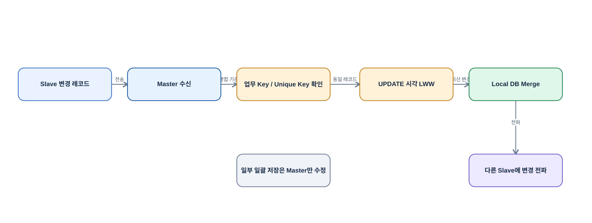
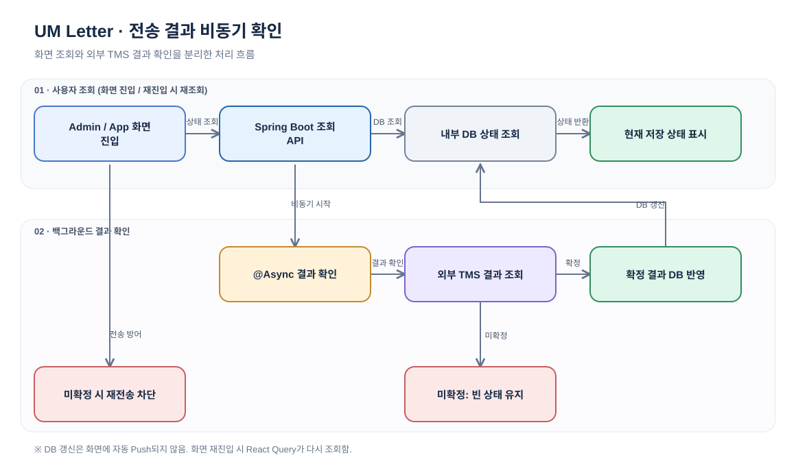

# Online/Offline Operations System

**영역:** 온라인·오프라인 전환을 고려한 항공 객실 업무 통합 시스템  
**기간:** 2026.01–2026.09  
**주요 기술:** Java, Spring Boot, React, TypeScript, React Native, PostgreSQL, Redis, SQLite, Bluetooth

## 프로젝트 개요

객실 승무원이 비행·승객·기내 서비스 정보를 조회하고 업무를 처리하는 Mobile/Hybrid App과 운영자용 Admin, 협력사용 Partner 시스템 구축 프로젝트임.

기내에서는 네트워크 연결이 제한될 수 있으므로 **온라인·오프라인 모두에서 업무를 처리하고 연결 상태 변화에도 업무를 이어갈 수 있도록** 서버 API, Local DB, 단말 간 Bluetooth 동기화를 함께 고려했음. React WebView, React Native/Native Bridge, Spring Boot, 기업 내외부 연계 시스템이 연결되는 구조였음.

## 담당 역할과 기술

- **직접 담당:** Full-stack 개발, 기내식 탑재량 조회 API 병목 분석 및 인덱스 개선, Local-first 화면 조회, Bluetooth 변경 데이터·충돌 정책 조정, UM Letter 기능 전체 설계
- **설계·협업:** 외부 시스템 API 명세 협의부터 통합 테스트·오류 대응까지 조율. Local DB 정리 시점 변경은 타 조직 Solution Architect 및 고객과 협의해 반영함. Native Bluetooth 구현은 다른 담당자와 협업함
- **기술 스택:** React, TypeScript, React Native, WebView, TanStack Query / Java, Spring Boot / PostgreSQL, Redis, SQLite, WebCache / Bluetooth, Native Bridge / API Gateway, EAI, ERP / AWS, S3, CDN

## 시스템 구조 — 온라인·오프라인 전환

- **온라인:** Spring Boot API와 기업 내외부 시스템 연계로 데이터를 조회·처리함.
- **오프라인:** SQLite 등 Local DB에 저장된 데이터를 표시하고, Bluetooth로 단말 간 변경 데이터를 동기화함.
- **연결 상태 변화:** 화면에 기존 데이터를 우선 표시하고, 갱신·동기화 과정에서 업무 데이터의 정합성을 고려함. 모든 전환 시나리오의 무손실을 정량 검증했다는 의미는 아님.

## 사례 1. 기내식 탑재량 조회 성능 개선

### 문제와 원인

기내식 탑재량(Meal Inventory)·갤리 정보(Galley Information) 관련 특정 조회 API에서 약 12초의 응답 지연이 발생함. 디버깅 결과 네트워크 전달 과정이 아닌 **MyBatis SQL 실행 구간**에서 병목을 확인함.

### 구현

- 조회 SQL의 검색 조건을 분석하고 이에 맞는 DB 인덱스를 적용함.
- 화면 진입 시 기존 Local DB 데이터를 먼저 표시하고, 서버 API 조회 및 Local DB 갱신은 뒤에서 수행하도록 변경함.
- 데이터 갱신 후 React Query `invalidateQueries()`로 화면 데이터를 다시 조회하도록 구성함.
- 검색 조건 변경 중 기존 결과가 사라지는 현상은 캐시·로딩 상태·메모이제이션을 활용해 개선함.

### 결과와 한계

**개발 과정에서 직접 측정한 특정 조회 API 응답 시간 약 12초 → 3초 이하로 개선함.** 실제 서비스 성능 검증은 성능 테스트 담당자와 별도로 협업함. 인덱스 추가에 따른 쓰기·유지 비용은 고려할 사항임.

> 이 사례는 **Backend 조회 성능과 화면 응답성** 개선이며 Bluetooth 동기화와 별개임.

## 사례 2. Bluetooth 단말 간 데이터 동기화

### 문제와 설계 판단

기내에서 Master와 여러 Slave가 서로 다른 데이터를 보유하거나 같은 기내식 주문을 수정할 수 있었음. 송신 단말의 변경이 수신 단말 데이터를 예상과 다르게 덮어쓰는 현상이 있어 충돌 기준이 필요했음.

기내식 주문은 **마지막으로 변경한 주문이 현재 유효한 상태**라는 업무 규칙을 확인하고 UPDATE 시각 기반 LWW(Last-Write-Wins)를 선택함. 일반 데이터는 Master·Slave 모두 수정할 수 있으며, 특정 일괄 저장 기능만 Master 수정·Slave 조회 전용으로 구분함.

### 구현 구조

[Draw.io 원본 편집](../diagrams/bluetooth-merge.drawio)

- 변경 전후를 비교해 변경된 레코드 전체를 전송하고, 변경이 없으면 전송을 생략함.
- 업무 Key와 Unique Key를 기준으로 레코드를 식별하고, UPDATE 시각을 비교해 유효한 변경을 반영함.
- Native Bridge를 통한 복수 DML을 단일 Local DB 트랜잭션으로 처리하고 중복 데이터는 UPSERT로 반영함.
- FE에서 Native로 전달하는 데이터를 줄이고 큰 Payload에만 선택적으로 Chunking을 적용함.
- 대량 Reference 다운로드와 문서·이미지 다운로드 Queue를 분리함.
- Native에서 마지막 동기화 시각을 관리하고, 재연결 시 누락된 변경을 다시 전송하도록 구성함.

### 결과와 한계

업무 규칙에 맞는 충돌 기준을 마련하고 단말 간 변경 전파 구조를 개선함. 다만 LWW는 변경 이력 전체를 보존하지 않으며, 기기 간 시각 차이에 영향을 받을 수 있음. Master 중심 전달 구조에도 의존성이 존재함.

## 사례 3. UM Letter 메일 발송 결과 처리

### 문제

**TMS(메일 전송 시스템)**는 메일 발송 요청을 접수하고 최종 발송 결과를 별도로 제공하는 외부 시스템임. UM Letter 기능에서는 전송 요청 API가 성공하더라도 **실제 메일 발송 성공·실패가 즉시 확정되지 않을 수 있었음.** 결과 조회 API에 상태가 반영되기까지 시간이 걸려, 요청 성공을 최종 발송 성공으로 표시하면 상태가 달라지는 문제가 있었음.

### 설계 및 구현

[Draw.io 원본 편집](../diagrams/um-letter-async.drawio)

- Admin·App의 화면 진입 시 Spring Boot 조회 API가 내부 DB의 현재 상태를 반환하도록 구성함.
- TMS 최종 결과 확인은 Spring Boot `@Async`로 분리함. 확인된 성공·실패 상태와 TMS 응답 코드를 내부 DB에 저장함.
- 결과가 확정되지 않았을 때는 상태를 빈값으로 유지하고, 화면에서 이를 실패로 취급하지 않도록 함.
- **화면 재진입 시 React Query 재조회**로 최신 저장 상태를 확인함. DB 변경이 화면으로 실시간 Push되는 방식은 아님.
- 결과 미확정 상태에서는 재전송 버튼을 눌러도 재전송 API가 호출되지 않도록 상태 조건으로 방어함.

### 결과와 한계

사용자 조회가 TMS의 최종 결과 확정을 동기적으로 기다리지 않도록 분리하고, 요청 성공과 최종 발송 결과를 구분함. 단, 화면 첫 조회에서는 이전 DB 상태가 표시될 수 있으며 최종 상태는 다음 조회에서 확인됨. **UM Letter 기능의 전체 설계를 직접 담당함.**

## 사례 4. Local DB 정리 시점 변경

타 조직에서 앱 Splash 시점에 만료된 Local DB 데이터를 일괄 삭제하는 방안을 제안했음. 데이터 증가 시 앱 시작 경로에 정리 작업이 집중될 수 있어, **업무 화면 진입 시 해당 업무의 만료 데이터만 정리**하는 대안을 제시함. 타 조직 Solution Architect 및 고객과 장단점을 협의해 설계에 반영함.

초기 진입 시 작업 집중을 피하는 대신, 업무 최초 진입 시 정리 비용이 발생하고 미진입 업무의 만료 데이터는 즉시 정리되지 않을 수 있음. 실제 앱 시작 시간 개선 수치는 측정된 결과가 없어 기재하지 않음.
