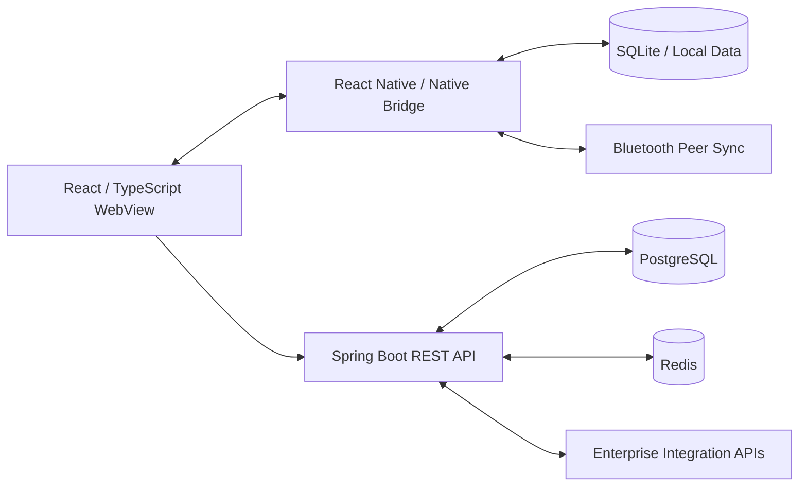
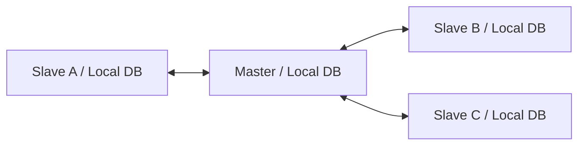

# Offline-first Operations System

**영역:** 연결이 제한된 현장 업무용 통합 시스템  
**기간:** 2026.01–2026.09  
**주요 기술:** Java, Spring Boot, React, TypeScript, React Native, TanStack Query, PostgreSQL, Redis, SQLite, Bluetooth

## System Architecture

이 시스템은 **React/TypeScript 기반 Hybrid App**, **Java/Spring Boot Backend**, **Local DB 및 Bluetooth 동기화**, **기업 내외부 시스템 연계**로 구성됐습니다. 모바일 화면뿐 아니라 백엔드 API, 데이터 저장소, 외부 시스템 인터페이스까지 연결되는 Full-stack 개발 환경이었습니다.

- **Mobile:** React WebView와 React Native/Native Bridge를 통한 현장 업무 처리
- **Backend:** Spring Boot REST API 및 외부 시스템 인터페이스
- **Data:** 서버 PostgreSQL·Redis, 단말 SQLite 및 로컬 캐시
- **Offline:** Bluetooth 기반 단말 간 변경 데이터 동기화

## Case A — 조회 API 및 Local-first UI 개선

### Problem

특정 업무 데이터 조회 API가 약 12초의 응답 지연을 보였습니다. 화면 진입·재진입 시 API 응답과 Local DB 갱신 완료를 기다리면서 기존 저장 데이터를 빠르게 표시하지 못했고, 검색 조건 변경 중 이전 결과가 사라지는 문제가 있었습니다.

### My Contributions

- DB 인덱스 최적화로 **특정 조회 API의 응답 시간 약 12초 → 3초 이하** 개선
- **STG 환경에서 개발 도구로 직접 측정**하고, **운영 환경에서 성능 테스트 담당자와 별도 검증 협업**
- 화면 진입 시 기존 Local DB 데이터를 먼저 표시하는 Local-first 조회 흐름 구현
- API 조회와 Local DB 갱신을 백그라운드로 수행한 후 `queryClient.invalidateQueries()`로 데이터 재조회
- 검색 조건 변경 시 이전 결과를 유지하고, `isFetching`, 캐시 정책, 메모이제이션을 활용해 상태 표시 개선

### Performance Result

| 항목 | 확인된 사실 |
| --- | --- |
| 대상 | 특정 업무 데이터 조회 API |
| STG 직접 측정 | 약 12초 → 3초 이하 |
| 협업 | 운영 환경 성능 테스트 담당자와 개선 결과 검증 |

## Case B — Bluetooth Star Topology 동기화

### Problem

여러 단말이 오프라인에서 각각 Local DB를 수정할 수 있어 변경 전파, 충돌 해결, 재연결 이후 동기화가 필요했습니다.

### Architecture

- **Master와 Slave 모두 일반 데이터 수정 가능**합니다. 전체 시스템이 Single-Writer인 것은 아닙니다.
- 한 Slave의 변경을 Master가 자신의 Local DB에 반영한 뒤 다른 Slave에 전파합니다.
- 특정 일괄 저장 기능만 Master에서 수정 가능하고 Slave에서는 조회 전용입니다.

### My Contributions & Consistency Rules

- 변경 전후를 비교해 **변경된 레코드 전체**를 전송하고, 변경이 없으면 전송을 생략
- 같은 레코드가 반복 변경되면 전송 직전 최신 상태를 추출; 이벤트 이력 전체를 재생하는 구조는 아님
- Master·Slave에서 수정 동작마다 UPDATE 시각 관리
- 단말 간 동일 레코드 충돌 시 UPDATE 시각을 비교해 최신 시각 우선 적용 (Last-Write-Wins)
- Native Bridge를 통한 INSERT/UPDATE/DELETE 복수 DML을 **단일 Local DB 트랜잭션**으로 처리; 중복 데이터에 UPSERT 적용
- Master·Slave 양측에 Optimistic UI 적용; 실패 시 Local DB 재조회로 화면 보정
- Native가 마지막 동기화 시각을 관리하고, 재연결 시 놓친 변경을 다시 전송

### Design Trade-offs

- Master 중심 릴레이는 전달 경로를 단순화하지만 Master에 대한 의존성이 생깁니다.
